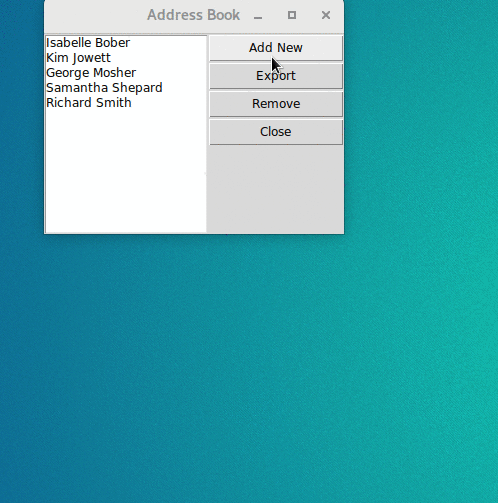

# AddressBook
A desktop application that stroes the addresses of users in a database. Written in Python and using a MySQL database. GUI is made with `TKinter` library included with Python.

## Video Demo

